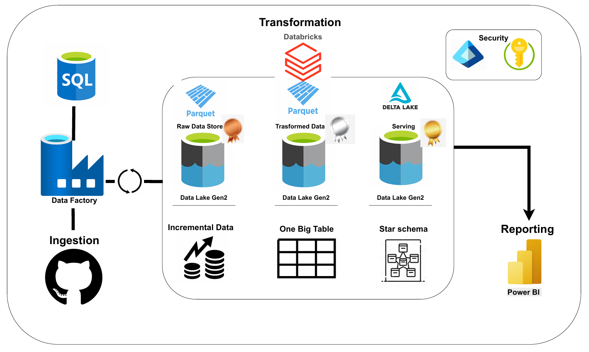
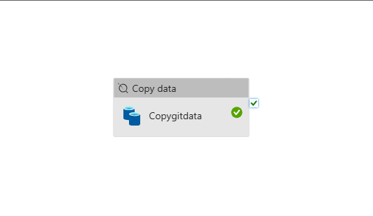
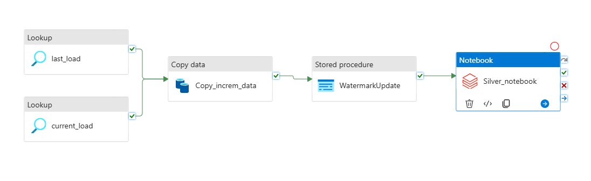
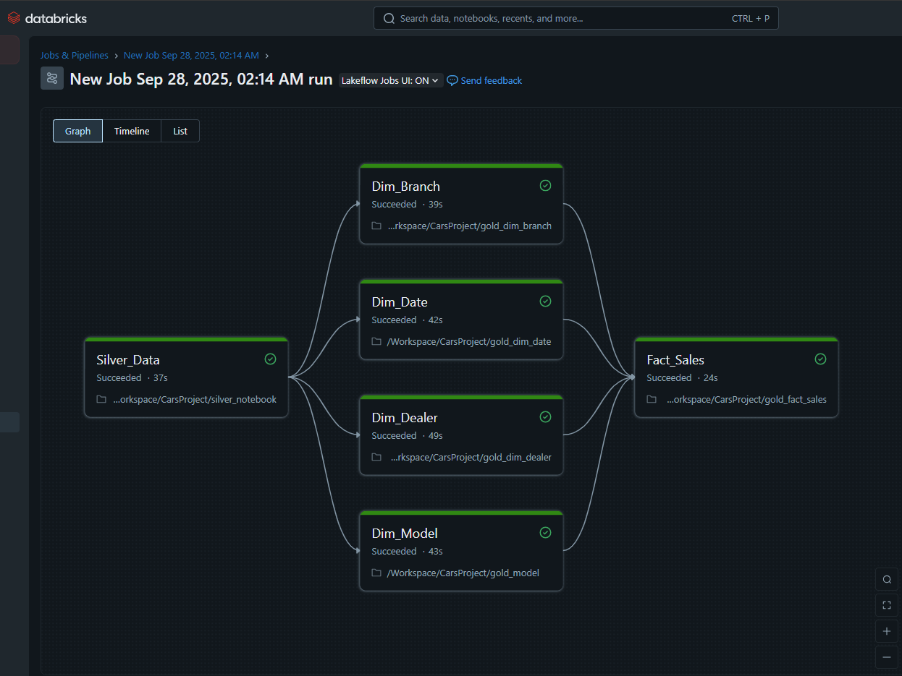

# Azure Databricks Medallion Architecture — Production Deployment

This project implements a **production-ready medallion architecture** on **Azure Databricks** with full integration of data lake storage, incremental pipelines, orchestration, and governance.  
The solution enables scalable ingestion, transformation, and consumption of enterprise data with **parquet-based storage**, **Azure security services**, and **Unity Catalog** for centralized governance.

---

## High-Level Architecture

The architecture follows the **Bronze → Silver → Gold** paradigm:

1. **Bronze Layer** – Raw ingestion of structured and semi-structured data in parquet format.  
2. **Silver Layer** – Cleansed and enriched datasets, harmonized for downstream use.  
3. **Gold Layer** – Curated, business-ready dimensional models in a **Star Schema** (fact and dimension tables) to power analytics and machine learning.

---

## Data Pipelines

Data ingestion and transformation are orchestrated with **Azure Data Factory (ADF)** and executed on **Azure Databricks**. Two types of pipelines are demonstrated:

- **Copy Pipeline** – Moves data securely from a source dataset into the bronze zone of the data lake.  

- **Incremental Pipeline** – Performs incremental loads into the silver and gold layers, ensuring efficiency and scalability for large datasets.  

---

## Databricks Workflows

Within Databricks, notebooks orchestrate transformations across layers:

- **Silver Notebook** – Standardizes and cleanses ingested data.  
- **Gold Dimension Notebooks** – Build dimension tables such as `dim_branch`, `dim_date`, `dim_dealer`, `dim_model`.  
- **Gold Fact Notebook** – Creates the sales fact table, linked to the dimensions.  

The following diagram illustrates the dependencies:  

---

## Star Schema and SCD Management

The **Gold Layer** implements a **Star Schema** with a central fact table (`fact_sales`) connected to multiple dimension tables (`dim_branch`, `dim_date`, `dim_dealer`,`dim_model`.).  

To maintain historical accuracy and support business reporting, the solution applies **Slowly Changing Dimensions (SCD Type 2)** techniques, ensuring changes in attributes (e.g., dealer name, branch details) are tracked over time without losing history.

This design provides:  
- High-performance querying for BI tools.  
- Historical tracking of dimension changes.  
- Reliable fact-to-dimension relationships for analytics and ML pipelines.  

---

## Security and Governance

The solution applies **enterprise-grade security controls** across the stack:

- **Azure Data Lake Storage Gen2** – Stores parquet datasets with fine-grained **IAM roles**.  
- **Azure Key Vault** – Centralized management of secrets, credentials, and keys.  
- **Unity Catalog** – Provides unified governance, access control, and lineage tracking across workspaces.  
- **Role-Based Access Control (RBAC)** – Ensures least-privilege access to pipelines, storage, and Databricks resources.  

These layers ensure compliance, scalability, and secure collaboration across teams.

---

## Business Value

This deployment enables organizations to:

- Establish a **scalable and governed data platform**.  
- Enable **real-time and batch ingestion** with incremental processing.  
- Provide **curated gold datasets** using a **Star Schema with SCD management** for analytics, BI dashboards, and machine learning models.  
- Ensure **data privacy and compliance** through IAM, Vault, and Unity Catalog integration.  

---

## Project Scope

This repository includes:

- **Screenshots** of pipelines and Databricks workflows.  
- **Configuration exports** for orchestration (ADF and Databricks).  

The actual data pipelines, transformations, and data lake implementation reside in the **Azure cloud environment** and are production-ready.

---

## Tech Stack

- **Azure Data Factory (ADF)** – Orchestration  
- **Azure Databricks** – Data transformation and workflows  
- **Azure Data Lake Storage Gen2** – Parquet-based data storage  
- **Azure Key Vault** – Secret and key management  
- **Unity Catalog** – Data governance and lineage  
- **Star Schema with SCD** – Business-ready data modeling  

